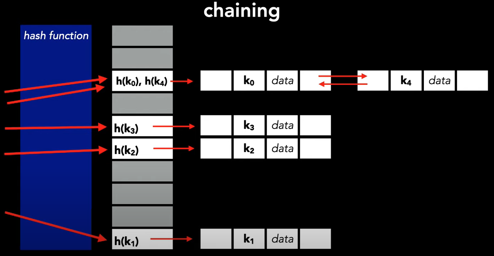

# data-structure

## Install black formatter

```bash
pip install black
```

## Big O notation

Big O Notation is a metric for determining an algorithm's efficiency. Put simply, it gives an estimate of how long it takes your code to run on different sets of inputs. You can also see it as a way to measure how effectively your code scales as your input size increases.

### Time Complexity

The time complexity, computational complexity or temporal complexity describes the amount of time necessary to execute an algorithm. It is not a measure of the actual time taken to run an algorithm, instead, it is a measure of how the time taken scales with change in the input length.

### Space Complexity

The overall amount of memory or space utilized by an algorithm/program, including the space of input values for execution, is called space complexity. To determine space complexity, simply compute how much space the variables in an algorithm/a program take up.

- Cheat Sheet: https://flexiple.com/algorithms/big-o-notation-cheat-sheet/
- Video: https://www.youtube.com/watch?v=v4cd1O4zkGw

Following are the key time and space complexities:

- Constant: O(1)
- Linear time: O(n)
- Logarithmic time: O(n log n)
- Quadratic time: O(n^2)
- Exponential time: 2 ^(n)
- Factorial time: O(n!)

### Constant Time: O(1)

When there is no dependence on the input size n, an algorithm is said to have a constant time of order O(1).

```python
def example_function(lst):
    print("First element of list: ", lst[0])
```

### Linar Time: O(n)

Linear time is achieved when the running time of an algorithm increases linearly with the length of the input. This means that when a function runs for or iterates over an input size of n, it is said to have a time complexity of order O(n).

```python
def example_function(lst, size):
    for i in range(size):
        print("Element at index", i, " has value: ", lst[i])
```

Note: Even if you iterate over half the array, the runtime still depends on the input size, so it will be considered O(n).

### Logarithm Time: O(log n)

When the size of the input data decreases in each step by a certain factor, an algorithm will have logarithmic time complexity. This means as the input size grows, the number of operations that need to be executed grows comparatively much slower.

Example
Binary search and finding the largest/smallest element in a binary tree are both examples of algorithms having logarithmic time complexity.

```python
def binarySearch(lst, x):
    low = 0
    high = len(lst)-1
    # Repeat until the pointers low and high meet each other
    while low <= high:

        mid = low + (high - low)//2

        if lst[mid] == x:
            return mid

        elif lst[mid] < x:
            low = mid + 1

        else:
            high = mid - 1

    return -1
```

### Quadratic Time: O(n^2)

The performance of a quadratic time complexity algorithm is directly related to the squared size of the input data collection. You will encounter such time complexity in programs when you perform several iterations on data sets.

```python
def quadratic_function(lst, size):
    for i in range(size):
        for j in range(size):
            print("Iteration : " i, "Element of list at ", j, " is ", lst[j])
```

We have two nested loops in the example above. If the array has n items, the outer loop will execute n times, and the inner loop will execute n times for each iteration of the outer loop, resulting in n^2 prints. If the size of the array is 10, then the loop runs 10x10 times. So the function ten will print 100 times. As a result, this function will take O(n^2) time to complete.

### Exponential Time: O(2^n)

With each addition to the input (n), the growth rate doubles, and the algorithm iterates across all subsets of the input elements. When an input unit is increased by one, the number of operations executed is doubled.

```python
def fibonacci(n):
    if (n <= 1):
        return 1
    else:
        return fibonacci(n - 2) + fibonacci(n - 1)
```

---

## Array

### Contiguous area of memory

- Random access
- Constant time access to any particular element in an array (read and write)

### Times for commons operations

- Adding at the end: O(1)
- Removing at the end: O(1)

- Adding at the beginning: O(n)
- Removing at the beginning: O(n)

- Adding at the middle: O(n)
- Removing at the middle: O(n)

Arrays are great if you want to add or remove at the end. But, expensive if you want to add or remove in the middle or at the beginning

**Huge advantage:** Constant time to access elements.

---

## LinkedList

A LinkedList is a linear data structure in which elements are stored in nodes. Each node contains a value and a pointer that points to the next node in the sequence. In this way, elements are organized sequentially, but not necessarily in contiguous memory positions.

| Singly-Linked List | no tail | with tail |
| ------------------ | ------- | --------- |
| push_front         | O(1)    |           |
| top_front          | O(1)    |           |
| pop_front          | O(1)    | O(1)      |
| push_back          | O(n)    | O(1)      |
| top_back           | O(n)    | O(1)      |

---

## Stack

The stack follows the LIFO (Last in - First out) structure where the last element inserted would be the first element deleted. It's like a stack of books.

- Adding an element = O (1)
- Removing an element = O (1)

Stacks can be implemented with either an array or a linked list:

### Arrays - [Stack array implementation](python/stack/stack_array.py)

Disadvantage of arrays: you've potentially over-allocated.

### LinkedLists - [PENDING TO IMPLEMENT]

For array we have a maximum size, and for linke-lists we don't.
But, for linked-lists we've got the overhead of storing a pointer as well.

### Most common algorithm:

- Balanced brackets

---

## Queue

The queue follows the FIFO (First in - First out) structure where the first element inserted would be the first element deleted. It's like a line of people waiting the bus.

Queues can be implemented with either an array or a linked list (with tail pointer).
For array we have a maximum size, and for linke-lists we don't.
But, for linked-lists we've got the overhead of storing a pointer as well.

- Enqueue = O(1)
- Dequeue = O(1)
- isEmpty = O(1)

### Arrays

[Implementation](python/queue/queue_array.py)

### Fixed-sized array

[Pending to implement]

### LinkedLists

[Pending to implement]

---

## Hash Table

Hash tables represents a dynamic set of data for INSERT, DELETE and SEARCH

Where hash table really shine is search:

- Average: O(1)
- Worse case O(n))

Hash table sometimes is used interchangeably with dictionary.

```python
dictionary = {
    'a': 1,
    'b': 9,
    'c': 'nebraska',
    'd': True
}
```

- Dictionary = generic way to MAP keys to values
- Hash table = implementation of a dictionary using a hash function

With hash table we introduce **hash-functions** that maps keys to a location in the table that holds data.

When two different hash functions (keys) points to the same data in the hash table, we called that as collision.

How to acomoddate collisions: Through **chaining**



To support chaining we introduce linked lists and our table locations become a bucket of values.

### Hash function goals

- Goals

  - Maximizes randomness
  - Produces the least amount of colisions

- Examples

  - division
  - multiplication
  - universal hashing
  - dynamic perfect hashing

### Hash by division

This is one of the simplest ways to create a hash function, although it may not be the most efficient in all cases.

```python
def hashing_by_division(k, m):
    return k % m

k = 50
m = 13
print(f'hash of 50 with table size 13 --> {hashing_by_division(k, m)}') # The hash value here is 11
```

- [See more here - Code](python/queue/queue_array.py)
- [Source - Youtube link](https://www.youtube.com/watch?v=knV86FlSXJ8)

---

## Binary Search

Given a list of sorted items, the binary search algorithm makes a binary decision, **left or right**, **greater than or less than**, **alphabetically**

To apply binary search in any data structure, the data structure must maintain the following properties:

- The data structure must be sorted.
- Access to any element of the data structure takes constant time.

The most popular use of a binary search is a sorted array.

- [Recursive Implementation - example](python/binary-search/binary-search-recursive.py)
- [Iterative Implementation - example](python/binary-search/binary-search-iterative.py)

Big O of Binary Search

```
O(log n)  =>  worse and average case
O(1)      =>  Best case
```

---

## Bit Manipulation

[Reference Implementation - example](python/bit-manipulation/bit-manipulation.py)

When we store a number in the computer, we store a series of ones and zeros (everything is a bit)

Operators:

- AND = &
- OR = |
- XOR (Exclusive OR) = ˆ
- NOT = ~
- LEFT SHIFT = <<
- RIGHT SHIFT = >>

### AND

Only true if both inputs are true

```
0 & 0 = 0
0 & 1 = 0
1 & 0 = 0
1 & 1 = 1
```

### OR

True if any input bit is true

```
0 | 0 = 0
0 | 1 = 1
1 | 0 = 1
1 | 1 = 1
```

### XOR

True if and only one input bit is true

```
0 | 0 = 0
0 | 1 = 1
1 | 0 = 1
1 | 1 = 0
```

### NOT

One's complement operator, flips the input bit **~0 = 1**, **~1 = 0**

```
~0 = 1
~1 = 0
```

### LEFT SHIFT

Left shift operator is a binary operator which shift the some number of bits, in the given bit pattern, to the left and append 0 at the end.

```
00010110
00000010 (shift it 2 places)
========
01011000
```

### RIGHT SHIFT

Right shift operator is a binary operator which shift the some number of bits, in the given bit pattern, to the right and append 1 at the end.

```
00010110
00000010 (shift it 2 places)
========
00000101
```

---

## Trees

A Tree data structure is a hierarchical structure that is used to represent and organize data in a way that is easy to navigate and search. It is a collection of nodes that are connected by edges and has a hierarchical relationship between the nodes

[Generic example with DFS search](./python/tree/dfs_generic.py)

### Tree Waks:

**DFS - Depth first searchs** (a tipically recursive algorithm)

We completely traverse one sub-tree before exploring a sibling sub-tree

- Stack
- time complexity: O(n)
- space complexity: best: O(log n) - avg. height of tree worst: O(n)
- inorder (DFS: left, root, right)
- postorder (DFS: left, right, root)
- preorder (DFS: root, left, right)

**BFS - Breadth First search**

We traverse all nodes at one level before progressing to the next level

- Queue
- level order (BFS, using queue)
- time complexity: O(n)
- space complexity: best: O(1), worst: O(n/2)=O(n)

---

## Graphs

Important points:

- Familiarize yourself with each representation and its pros & cons
- BFS and DFS - know their computational complexity, their trade offs, and how to implement them in real code
- When asked a question, look for a graph-based solution first, then move on if none
- BFS uses Queue
- BFS uses Stack

The only catch here is, that, unlike trees, graphs may contain cycles, so we may come to the same node again. To avoid processing a node more than once, we divide the vertices into two categories:

- Visited
- Not visited

Implementations:

- [BFS](./python/graph/bfs_graph.py)
- [DFS](./python/graph/dfs_graph.py)

Resources:

[Reference 1](https://www.youtube.com/watch?v=pcKY4hjDrxk)

---

## Sorting

### Merge Sort

Merge sort is defined as a sorting algorithm that works by dividing an array into smaller subarrays, sorting each subarray, and then merging the sorted subarrays back together to form the final sorted array.

Merge sort is a recursive algorithm that continuously splits the array in half until it cannot be further divided i.e., the array has only one element left (an array with one element is always sorted). Then the sorted subarrays are merged into one sorted array.

- Time Complexity: O(n log n)
- Space complexity: O(n) - Merge sort requires additional memory to store the merged sub-arrays during the sorting process.

[Top-down approach implementation](./python/sorting/merge-sort-top-down.py)

[Bottom-up approach implementation](./python/sorting/merge-sort-bottom-up.py)

### Quick Sort

//Need to implement

## Dynamic Programming

Dynamic programming is a development method that seeks to find the solution of several subproblems to, then, find the solution of the general problem.

Fibonacci is a classical implementation

### Top-Down Approach

- Uses Memoization (cache)
- Recursive - [Implentation Example](./python/dynamic-programming/fibonacci_bottom_up.py)

### Bottom-up approach

- Iterative - [Implentation Example](./python/dynamic-programming/fibonacci_bottom_up.py)
